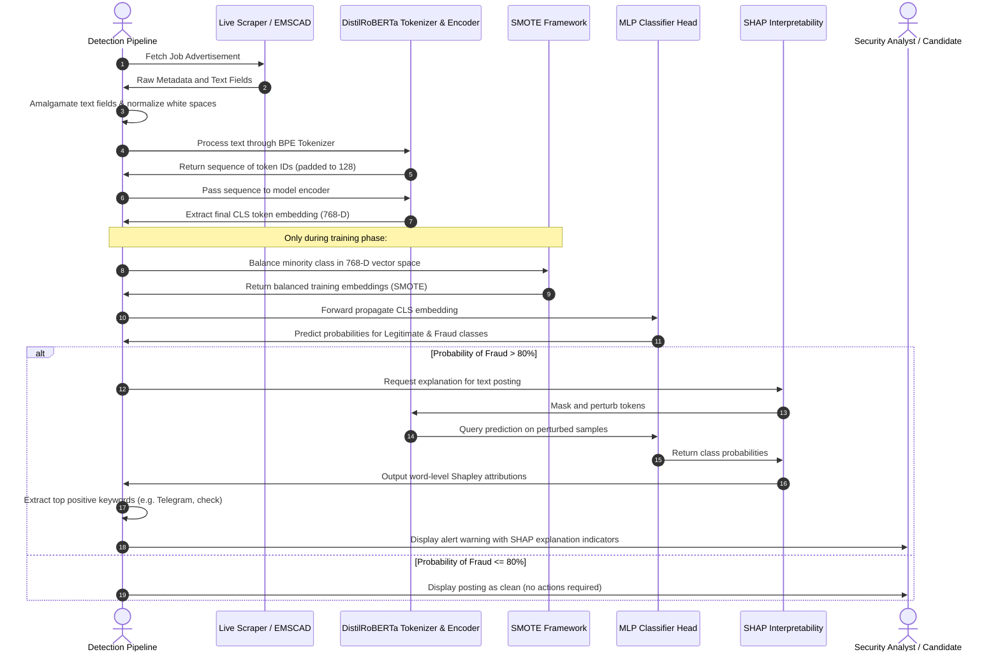

# CHAPTER 3: MATERIALS AND EXPERIMENTAL METHODOLOGY

---

## 3.1. Introduction

Online Recruitment Fraud (ORF) has emerged as a critical threat in the modern digital job market. With the rise of digital professional networks, remote job boards, and automated aggregator platforms, malicious actors have found it increasingly easy to publish fraudulent job advertisements. These fraudulent postings (often referred to as job scams) target vulnerable job seekers with various malicious objectives, including financial extortion, identity theft, harvesting of sensitive personal data, and money laundering. Traditional methods of detecting these scams rely heavily on manual moderation, user reporting, and keyword-based rule sets. While these approaches can catch basic, repetitive scams, they fail against sophisticated, dynamically written postings that mimic legitimate corporate communications. Manual reviews are also slow, labor-intensive, and impossible to scale across millions of live job listings published daily.

To overcome these challenges, this study proposes an advanced, automated, and explainable Online Recruitment Fraud (ORF) detection system. The pipeline integrates state-of-the-art Natural Language Processing (NLP) techniques, machine learning classifiers, class-balancing frameworks, and model interpretability tools to deliver high-accuracy predictions accompanied by transparent justifications. 

```mermaid
graph TD
    A[Scrape or Collect Raw Job Postings] --> B[Concatenate Text Fields: Title, Company Profile, Description, Requirements, Benefits]
    B --> C[Preprocessing: Whitespace Removal, Null Handling, Filtering]
    C --> D[Stratified Train-Test Split: 80% Train, 20% Test]
    D --> E[Feature Extraction: DistilRoBERTa Pre-trained Transformer]
    E --> F[Extract CLS Token Embeddings: 768-Dimensional Vector]
    F --> G[SMOTE Over-Sampling: Balance Minority Fraud Class in Embedding Space]
    G --> H[Train Classification Head: Multi-Layer Perceptron (128, 64)]
    H --> I[Evaluate on Stratified Imbalanced Test Set]
    I --> J[Run Inference & Explainability: SHAP Partition Explainer]
    J --> K[Generate Candidate Security Warning Alerts]
```

As illustrated in the workflow above, the methodology follows a structured, sequential pipeline. The process begins with raw data collection from the **EMSCAD (Employment Metadata for Spam Detection)** dataset, alongside a live scraper module designed to fetch job postings from remote job portals. Once collected, raw features undergo cleaning and text concatenation to form a unified document representing the job. This consolidated text is processed through a pre-trained **DistilRoBERTa** transformer model, extracting contextual representation vectors from the `[CLS]` token. 

Because fraudulent postings constitute a small fraction of the job market (typically around 5%), the extracted vector embeddings are highly imbalanced. To prevent the classifier from being biased toward legitimate postings, we apply the **Synthetic Minority Over-sampling Technique (SMOTE)** directly within the high-dimensional vector space. On this balanced dataset, a **Multi-Layer Perceptron (MLP)** neural classifier head is trained. Finally, to ensure transparency, security analysts and applicants are provided with word-level attributions calculated using **SHAP (Shapley Additive exPlanations)** values, exposing the exact linguistic triggers (such as "Telegram", "WhatsApp", or money transfer demands) that led to a fraud warning.

---

## 3.2. Data Collection and Preprocessing

### 3.2.1. The EMSCAD Dataset
The primary dataset utilized in this research is the Employment Metadata for Spam Detection (EMSCAD) dataset, originally compiled by Vidros et al. (2017). EMSCAD contains a total of **17,880** job postings, out of which **866** are confirmed fraudulent cases, and **17,014** are legitimate. This represents an extreme class imbalance, where fraudulent postings comprise only approximately **4.84%** of the entire dataset. This ratio accurately reflects real-world scenarios, where spam or fraudulent postings are sparse compared to the vast volume of legitimate job ads.

Each job posting in the dataset consists of a combination of structured metadata and unstructured free-text fields. The columns available in the raw dataset include:
- `title`: The job position title.
- `location`: Geographical location of the posting.
- `department`: Corporate department offering the role.
- `salary_range`: Expected salary boundaries (often left blank).
- `company_profile`: A brief history or description of the hiring organization.
- `description`: The core tasks, responsibilities, and details of the job.
- `requirements`: The qualifications, experience, and skills required from candidates.
- `benefits`: Perks, medical cover, retirement plans, and other incentives.
- `telecommuting`: A binary flag (0 or 1) indicating if the job is remote.
- `has_company_logo`: A binary flag showing if a company logo is present.
- `has_questions`: A binary flag indicating if screening questions are included.
- `employment_type`: The nature of employment (Full-time, Part-time, Contract, etc.).
- `required_experience`: The level of seniority required (Entry level, Associate, Mid-Senior, etc.).
- `required_education`: Minimum educational qualification.
- `industry`: The sector in which the company operates (IT, Healthcare, Finance, etc.).
- `function`: The occupational class of the role.
- `fraudulent`: The ground-truth target binary variable (0 for legitimate, 1 for fraudulent).

| Feature Name | Data Type | Missing Values (%) | Description |
| :--- | :--- | :--- | :--- |
| `title` | Text (Categorical) | 0.00% | The specific job title advertised. |
| `location` | Text (Categorical) | 1.93% | Country, state, and city of the listing. |
| `department` | Text (Categorical) | 64.58% | Department hosting the position. |
| `salary_range` | Text (Numeric range) | 83.95% | Financial compensation bounds. |
| `company_profile` | Free Text | 18.50% | Background description of the hiring entity. |
| `description` | Free Text | 0.01% | Primary job duties and responsibilities. |
| `requirements` | Free Text | 15.07% | Expected skills and educational background. |
| `benefits` | Free Text | 40.32% | Perks, compensations, and bonuses. |
| `telecommuting` | Binary (0 / 1) | 0.00% | Remote working indicator flag. |
| `has_company_logo`| Binary (0 / 1) | 0.00% | Logo presence indicator. |
| `has_questions` | Binary (0 / 1) | 0.00% | Screening questionnaire presence. |
| `employment_type` | Categorical | 19.41% | Type of contract (e.g., Full-time, Contract). |
| `required_experience`| Categorical | 39.43% | Career stage requirements. |
| `required_education`| Categorical | 45.40% | Minimum degree requirements. |
| `industry` | Categorical | 27.42% | Industry classification of the posting. |
| `function` | Categorical | 36.10% | Functional category of the role. |
| `fraudulent` | Binary (0 / 1) | 0.00% | Target label (0: Legitimate, 1: Fraudulent). |

### 3.2.2. Text Field Amalgamation
Traditional text classification models often train on a single text field, typically the `description` column. However, online recruitment scams often distribute red-flag indicators across different parts of the posting. For instance, a scam might present a highly professional, plagiarized `description` stolen from a legitimate corporation, but list suspicious terms in the `requirements` field (such as "must have a personal bank account to receive check deposits") or in the `benefits` field ("immediate daily payout via cash app"). Similarly, fraudulent operations often use suspicious, exaggerated claims in the `company_profile` section or leave it completely blank.

To capture the complete context of the job posting, we apply **Text Field Amalgamation**. We concatenate five primary free-text and short-text fields into a single unified textual sequence. For a given job posting $i$, the final text sequence $T_i$ is constructed as:

$$T_i = \text{title}_i \mathbin{\Vert} \text{company\_profile}_i \mathbin{\Vert} \text{description}_i \mathbin{\Vert} \text{requirements}_i \mathbin{\Vert} \text{benefits}_i$$

where $\mathbin{\Vert}$ represents string concatenation with a separating whitespace character. This ensures that the downstream language model receives a holistic view of the job post, enabling it to recognize correlations between a job's title, its description, and its requirements.

### 3.2.3. Preprocessing and Text Cleaning
Once the columns are concatenated, the raw text undergoes several cleaning steps:
1. **Handling Missing Values:** Text columns in the EMSCAD dataset frequently contain null values (`NaN` or empty entries). During concatenation, any null field is replaced with an empty string `""` to prevent the string `"nan"` from being injected into the final corpus, which would otherwise introduce noise.
2. **Whitespace Normalization:** Free-text inputs from job boards often contain extra spaces, consecutive newlines, tab characters, and HTML line breaks. The text is normalized using a whitespace tokenizer split-and-join operation:
   $$T_i \leftarrow \text{" ".join}(T_i\text{.split}())$$
   This collapses all consecutive whitespace characters into a single space and strips leading and trailing whitespaces.
3. **Filtering Empty Records:** Any post that results in a completely blank or whitespace-only string $T_i$ after cleaning is discarded from the dataset to ensure the model does not train on empty inputs.

### 3.2.4. Partitioning and Stratification
For training and evaluating the machine learning models, the preprocessed dataset is split into a **training set (80%)** and a **test set (20%)**. 

Given the severe class imbalance (approx. 95.16% legitimate vs. 4.84% fraudulent), random partitioning can lead to significant distribution shifts. For example, a random split might allocate a disproportionately small number of fraudulent records to the test set, leading to highly volatile evaluation metrics. To prevent this, **Stratified Splitting** is implemented. Stratification ensures that the proportion of legitimate to fraudulent records remains identical in both the training and testing sets.

If $Y$ represents the set of binary target labels, the partitioning function divides the indexes such that:

$$\frac{\sum_{j \in \text{Train}} I(y_j = 1)}{|\text{Train}|} \approx \frac{\sum_{k \in \text{Test}} I(y_k = 1)}{|\text{Test}|} \approx \frac{\sum_{i=1}^N I(y_i = 1)}{N}$$

where $I(\cdot)$ is the indicator function and $N$ is the total number of records.

| Dataset Split | Legitimate Class ($y=0$) | Fraudulent Class ($y=1$) | Total Records | Fraudulent Ratio (%) |
| :--- | :---: | :---: | :---: | :---: |
| Full Dataset | 17,014 | 866 | 17,880 | 4.84% |
| **Training Set (80%)** | 13,611 | 693 | 14,304 | 4.84% |
| **Testing Set (20%)** | 3,403 | 173 | 3,576 | 4.84% |

*(Note: During local execution and debugging, stratified sampling is applied to downscale the dataset size for computational efficiency, maintaining these exact target proportions.)*

---

## 3.3. Model Development: RoBERTa

### 3.3.1. Contextual vs. Static Word Representations
Older NLP approaches, such as Bag-of-Words (BoW), Term Frequency-Inverse Document Frequency (TF-IDF), or static word embeddings (Word2Vec, GloVe), treat words as independent tokens with static semantic representations. In static embeddings, the word "check" is assigned a fixed vector regardless of whether it appears in the phrase "background check completed" (legitimate corporate context) or "we will mail you a check to purchase equipment" (frequent fraud indicator).

To capture the context of words, modern architectures leverage Transformer models. In a Transformer, the vector representation of each word is dynamically constructed based on the surrounding words in the sentence. This is achieved through the self-attention mechanism, which enables the model to focus on relevant context words when computing the representation of a target token.

### 3.3.2. Transformer Architecture and Self-Attention
The foundation of the Transformer architecture is the scaled dot-product attention mechanism. Given an input matrix of vectors, the model projects them into three matrices: Queries ($Q$), Keys ($K$), and Values ($V$) using learnable weight matrices $\mathbf{W}_Q, \mathbf{W}_K, \mathbf{W}_V$. The attention weights are calculated as:

$$\text{Attention}(Q, K, V) = \text{softmax}\left(\frac{Q K^T}{\sqrt{d_k}}\right) V$$

where $d_k$ is the dimensionality of the key vectors. The division by $\sqrt{d_k}$ acts as a scaling factor to prevent the dot products from growing excessively large in high dimensions, which would push the softmax function into regions with extremely small gradients.

To allow the model to attend to information from different representation subspaces simultaneously, **Multi-Head Attention** is employed:

$$\text{MultiHead}(Q, K, V) = \text{Concat}(\text{head}_1, \dots, \text{head}_h) \mathbf{W}^O$$

$$\text{where} \quad \text{head}_i = \text{Attention}(Q\mathbf{W}_Q^{(i)}, K\mathbf{W}_K^{(i)}, V\mathbf{W}_V^{(i)})$$

where $\mathbf{W}_Q^{(i)}, \mathbf{W}_K^{(i)}, \mathbf{W}_V^{(i)}$ and $\mathbf{W}^O$ are projection matrices.

### 3.3.3. The RoBERTa Model
RoBERTa (Robustly Optimized BERT Approach), introduced by Liu et al. (2019), optimizes the training of the Bidirectional Encoder Representations from Transformers (BERT) model. The authors demonstrated that BERT was significantly undertrained and proposed several key adjustments:
1. **Dynamic Masking:** While BERT masks tokens once during preprocessing (static masking), RoBERTa applies masking dynamically every time a sequence is fed into the model. This generates varied training patterns across epochs.
2. **Removal of Next Sentence Prediction (NSP):** BERT trains on a secondary task to predict if Sentence B follows Sentence A. RoBERTa removes this objective, training solely on Masked Language Modeling (MLM) with full-length contiguous sequences, which improves performance on downstream tasks.
3. **Larger Mini-Batches:** Training with larger batch sizes (e.g., 8,000 samples) and higher learning rates stabilizes training and accelerates convergence.
4. **Larger Vocabulary:** RoBERTa uses a larger, byte-level Byte-Pair Encoding (BPE) vocabulary containing 50,265 subword tokens, compared to BERT's character-level BPE vocabulary of 30,000.

In this system, we use **DistilRoBERTa (`distilroberta-base`)**. DistilRoBERTa is a distilled version of RoBERTa trained using knowledge distillation. It features 6 transformer layers (instead of the 12 layers in `roberta-base`), reducing the parameter count from 125 million to 82 million. Despite this reduction, DistilRoBERTa retains approximately **95%** of the language representation capability of the base model while running up to **twice as fast**, making it highly suitable for real-time web scraping and inference pipelines.

```
Raw Text: "Urgent: Remote Job..." 
  │
  ▼  [Byte-Pair Encoding Tokenization]
Tokens: [<s>, "Ur", "gent", ":", "ĠRemote", "ĠJob", </s>, <pad>, ...]
  │
  ▼  [6 Transformer Encoder Layers (Self-Attention)]
Contextual Token Embeddings: H ∈ ℝ^(SeqLen x 768)
  │
  ▼  [Extract First Token (CLS Representation)]
CLS Embedding Vector: h_CLS = H[0, :] ∈ ℝ^768
  │
  ▼  [MLP Classifier Head]
  ├─► Dense Layer 1: 768 -> 128 (ReLU Activation)
  ├─► Dense Layer 2: 128 -> 64  (ReLU Activation)
  └─► Output Layer: 64 -> 2     (Softmax Probability Distribution)
```

### 3.3.4. Tokenization and Embedding Extraction
The text sequence $T_i$ is first tokenized using DistilRoBERTa's Byte-Pair Encoder. The tokenizer maps strings into sequence tokens:

$$\mathbf{t} = [t_0, t_1, t_2, \dots, t_{L-1}]$$

where $t_0$ is the start-of-sequence token `<s>` (equivalent to BERT's `[CLS]`), $t_{L-1}$ is the end-of-sequence token `</s>` (equivalent to `[SEP]`), and intermediate tokens represent subwords. The sequences are padded or truncated to a fixed maximum length of $L = 128$.

The tokens are passed through the pre-trained DistilRoBERTa encoder. The output of the final layer is a sequence of hidden state vectors:

$$\mathbf{H}_i = [\mathbf{h}_{i, 0}, \mathbf{h}_{i, 1}, \dots, \mathbf{h}_{i, L-1}], \quad \mathbf{h}_{i, j} \in \mathbb{R}^{768}$$

We extract the representation of the start token ($t_0 = \text{`<s>`}$):

$$\mathbf{x}_i = \mathbf{h}_{i, 0} \in \mathbb{R}^{768}$$

In Transformer models, the start token embedding collects information from all other tokens in the sequence through self-attention, serving as a semantic representation of the entire document. This process extracts a dense, continuous 768-dimensional feature vector $\mathbf{x}_i$ for every job posting.

### 3.3.5. Multi-Layer Perceptron (MLP) Classifier Head
Rather than using simple linear classifiers, this system processes the extracted embeddings through a Multi-Layer Perceptron (MLP) classification head. The MLP maps the 768-dimensional embedding vector to the class probabilities.

The network architecture is configured as follows:
- **Input Layer:** 768 dimensions (RoBERTa CLS representation).
- **Hidden Layer 1:** 128 neurons, utilizing Rectified Linear Unit (ReLU) activation and early stopping validation.
- **Hidden Layer 2:** 64 neurons, utilizing ReLU activation.
- **Output Layer:** 2 neurons, mapping to class probabilities via the Softmax function.

The forward propagation of the classification head is formulated as:

$$\mathbf{z}^{(1)} = \mathbf{W}^{(1)} \mathbf{x}_i + \mathbf{b}^{(1)}$$

$$\mathbf{a}^{(1)} = \text{ReLU}(\mathbf{z}^{(1)}) = \max(0, \mathbf{z}^{(1)})$$

$$\mathbf{z}^{(2)} = \mathbf{W}^{(2)} \mathbf{a}^{(1)} + \mathbf{b}^{(2)}$$

$$\mathbf{a}^{(2)} = \text{ReLU}(\mathbf{z}^{(2)}) = \max(0, \mathbf{z}^{(2)})$$

$$\hat{\mathbf{y}}_i = \text{Softmax}(\mathbf{W}^{(3)} \mathbf{a}^{(2)} + \mathbf{b}^{(3)})$$

where:
- $\mathbf{W}^{(1)} \in \mathbb{R}^{128 \times 768}$, $\mathbf{b}^{(1)} \in \mathbb{R}^{128}$
- $\mathbf{W}^{(2)} \in \mathbb{R}^{64 \times 128}$, $\mathbf{b}^{(2)} \in \mathbb{R}^{64}$
- $\mathbf{W}^{(3)} \in \mathbb{R}^{2 \times 64}$, $\mathbf{b}^{(3)} \in \mathbb{R}^{2}$

The model is optimized using the cross-entropy loss function:

$$\mathcal{L} = -\frac{1}{M} \sum_{i=1}^M \left[ y_i \log(\hat{y}_{i, 1}) + (1 - y_i) \log(\hat{y}_{i, 0}) \right]$$

where $y_i \in \{0, 1\}$ is the ground-truth label, and $\hat{y}_{i, 1}$ is the predicted probability of the posting being fraudulent.

To prevent overfitting on the synthetic representations, we allocate **10%** of the training data as a validation subset. We monitor the validation loss during training and trigger **Early Stopping** if the validation loss does not improve by a minimum threshold ($10^{-4}$) for **10 consecutive epochs**.

---

## 3.4. SMOTE Framework

### 3.4.1. The Imbalance Problem in Fraud Detection
When training classifiers on highly skewed datasets like EMSCAD (where only 4.84% of samples are fraudulent), standard machine learning algorithms often struggle. Because the majority class (legitimate jobs) dominates the loss function, a classifier can achieve 95.16% accuracy by predicting all listings as legitimate. However, this yields a recall of 0% for the fraudulent class, failing to detect any scams.

Common remedies include:
- **Random Under-Sampling (RUS):** Removing majority class samples. This throws away valuable training data, which can limit the classifier's ability to model the diversity of legitimate postings.
- **Random Over-Sampling (ROS):** Replicating minority samples. This can lead to overfitting, as the classifier learns to memorize specific fraudulent examples rather than generalizing.

To address these limitations, we implement the **Synthetic Minority Over-sampling Technique (SMOTE)**, proposed by Chawla et al. (2002).

### 3.4.2. Mathematical Formulation of SMOTE
SMOTE generates new, synthetic examples of the minority class by interpolating between existing minority samples.

For each minority sample $\mathbf{x}_i \in X_{\text{minority}}$:
1. Compute the Euclidean distance between $\mathbf{x}_i$ and all other minority samples $\mathbf{x}_j \in X_{\text{minority}}$:
   $$d(\mathbf{x}_i, \mathbf{x}_j) = \sqrt{\sum_{d=1}^D (x_{i, d} - x_{j, d})^2}$$
   where $D = 768$.
2. Identify the $k$-nearest neighbors. We use the standard setting of $k = 5$.
3. Randomly select one of these $k$-neighbors, denoted as $\mathbf{x}_{nn}$.
4. Generate a synthetic sample $\mathbf{x}_{\text{new}}$ along the line segment joining the two samples:
   $$\mathbf{x}_{\text{new}} = \mathbf{x}_i + \lambda (\mathbf{x}_{nn} - \mathbf{x}_i)$$
   where $\lambda$ is a random value drawn from a uniform distribution:
   $$\lambda \sim U(0, 1)$$

This process creates new minority samples within the feature space, expanding the decision boundary of the minority class.

```
       768-Dimensional Embedding Space
       
       (Legitimate Class: ◌,  Fraudulent Class: ●)
       
              ◌        ◌
                   ◌
             ●───────★───────● (x_nn)
            (x_i)  λ-interpolated
                     synthetic
                     
          ●                   ●
```

### 3.4.3. Oversampling in Embedding Space vs. Text Space
Oversampling is typically performed on the raw text (e.g., token replacement or back-translation) or on the vector representations. Applying SMOTE directly to raw text presents significant challenges:
- **Syntactic Disruption:** Randomly interpolating or replacing words often produces ungrammatical sentences that lack natural flow.
- **Discrete Structure:** Text is discrete, making linear interpolation difficult. While methods like token substitution or back-translation exist, they can alter the meaning or introduce noise.

Applying SMOTE in the **continuous 768-dimensional embedding space** of RoBERTa addresses these issues:
- **Semantic Continuity:** RoBERTa's embedding space represents semantic meanings as continuous vectors. Points close to each other in this space share similar semantic concepts.
- **Semantic Interpolation:** When SMOTE interpolates between two fraudulent vectors $\mathbf{x}_i$ and $\mathbf{x}_{nn}$, the resulting vector $\mathbf{x}_{\text{new}}$ represents a blend of the semantic properties of the two parent listings (e.g., combining characteristics of a check-cashing scam and a fake chat-app interview).
- **Efficiency:** Oversampling is performed on numerical vectors, avoiding the need to process raw text.

By balancing the classes post-embedding extraction, we provide the MLP classifier with a balanced training set while retaining the contextual representations generated by DistilRoBERTa.

| Class Label | Pre-SMOTE training Count | Post-SMOTE training Count | Status |
| :--- | :---: | :---: | :---: |
| **Legitimate ($y=0$)** | 13,611 | 13,611 | Unchanged |
| **Fraudulent ($y=1$)** | 693 | 13,611 | Synthetically Oversampled |
| **Total** | 14,304 | 27,222 | Balanced |

---

## 3.5. Experimental Evaluation Techniques

### 3.5.1. Evaluation Metrics
Evaluating a fraud detection model using accuracy alone can be misleading due to class imbalance. In this study, we monitor several performance metrics:

- **Accuracy:** The proportion of correct predictions out of all predictions.
  $$\text{Accuracy} = \frac{TP + TN}{TP + TN + FP + FN}$$
- **Precision:** The proportion of predicted fraud cases that are actually fraudulent. Higher precision reduces false positives, helping to ensure legitimate job postings are not incorrectly flagged.
  $$\text{Precision} = \frac{TP}{TP + FP}$$
- **Recall (Sensitivity):** The proportion of actual fraudulent cases that the model detects. Higher recall reduces false negatives, which is important for identifying as many scams as possible.
  $$\text{Recall} = \frac{TP}{TP + FN}$$
- **F1-Score:** The harmonic mean of precision and recall, providing a single metric that balances both.
  $$\text{F1-Score} = 2 \times \frac{\text{Precision} \times \text{Recall}}{\text{Precision} + \text{Recall}}$$

Here, $TP$ represents True Positives, $TN$ True Negatives, $FP$ False Positives, and $FN$ False Negatives.

### 3.5.2. Precision-Recall Area Under Curve (PR-AUC)
In highly imbalanced contexts, the Receiver Operating Characteristic Area Under the Curve (ROC-AUC) can present an overly optimistic view of model performance. This occurs because ROC-AUC plots the True Positive Rate against the False Positive Rate:

$$\text{FPR} = \frac{FP}{FP + TN}$$

Since the number of true negatives ($TN$, legitimate postings) is large, the denominator for FPR is also large, which can keep the FPR low even when the model produces many false positives.

To address this, we evaluate the model using the **Precision-Recall Area Under the Curve (PR-AUC)**. The PR-AUC evaluates precision against recall across different classification thresholds:

$$\text{PR-AUC} = \int_{0}^{1} P(R) \, dR$$

where $P(R)$ represents precision as a function of recall $R$. PR-AUC focuses on the minority class (fraudulent postings), making it a more reliable metric for evaluating model performance under class imbalance.

### 3.5.3. Explainability Framework: SHAP Values
Machine learning models, particularly deep neural networks, are often criticized for being "black boxes." In high-stakes applications like recruitment fraud detection, users and security analysts need to understand *why* a model flagged a posting as fraudulent. To provide this transparency, we integrate **SHAP (Shapley Additive exPlanations)**, proposed by Lundberg and Lee (2017).

SHAP is based on cooperative game theory. In this context, we treat the individual words in a job posting as "players" in a game, where the "payout" is the model's predicted probability of fraud. The Shapley value allocates a contribution score to each word based on its impact on the prediction.

The Shapley value $\phi_i$ for a feature (word) $i$ is calculated as:

$$\phi_i(v) = \sum_{S \subseteq N \setminus \{i\}} \frac{|S|! (|N| - |S| - 1)!}{|N|!} \left[ v(S \cup \{i\}) - v(S) \right]$$

where:
- $N$ is the set of all input features (all words in the job posting).
- $S$ is a subset of features excluding word $i$.
- $v(S)$ is the model's output probability when only the features in $S$ are present.
- $v(S \cup \{i\}) - v(S)$ is the marginal contribution of word $i$ when added to subset $S$.
- The fractional term $\frac{|S|! (|N| - |S| - 1)!}{|N|!}$ scales the marginal contribution by the number of possible permutations of the subset.

### 3.5.4. Text Partition Explainer for Word Attributions
Calculating exact Shapley values requires evaluating $2^{|N|}$ possible coalitions, which is computationally expensive for long text sequences. To make this tractable, we utilize the **SHAP Partition Explainer**. The partition explainer creates a hierarchical clustering tree over the input tokens based on their proximity. It then estimates Shapley values by calculating contributions across these partitions rather than individual tokens, reducing the computational complexity from exponential to polynomial time.

For raw text, the process works as follows:
1. The text is tokenized into subwords using the DistilRoBERTa tokenizer.
2. A background dataset is established by masking tokens using the tokenizer's `<pad>` token.
3. The model evaluates predictions on various masked sequences to measure how the absence of specific words affects the fraud probability.
4. Token attributions are calculated and mapped back to the input words.
5. Tokens containing RoBERTa's space character (`Ġ`) are cleaned, and punctuation or very short tokens (fewer than 3 characters) are filtered out to focus on meaningful words.

Words with the highest positive SHAP values represent the main contributors to the model's fraud prediction. These identified terms (e.g., "Telegram", "WhatsApp", "check", "deposit", "shipping") are extracted and included in candidate security warnings to provide context for the alert.

---

## 3.6. Summary of Methodology

The methodology proposed in this research implements a structured pipeline to address the challenges of Online Recruitment Fraud (ORF) detection: semantic nuances, class imbalance, and model explainability.

| Pipeline Component | Methods and Tools | Key Hyper-Parameters / Specifications |
| :--- | :--- | :--- |
| **Data Collection** | EMSCAD Corpus & Live Scraper | 17,880 listings (866 Fraudulent, 17,014 Legitimate) |
| **Preprocessing** | Concatenation & Normalization | Features: Title, Profile, Description, Requirements, Benefits |
| **Data Split** | Stratified Train-Test Split | 80% Train (14,304), 20% Test (3,576) |
| **Feature Extraction**| DistilRoBERTa (`distilroberta-base`) | 6 Layers, 768-dim embeddings, sequence length = 128 |
| **Class Balancing** | SMOTE in Vector Space | Neighbor count $k=5$, training sample expansion to 27,222 |
| **Classification Head**| Multi-Layer Perceptron (MLP) | Hidden Layers: `(128, 64)`, activation: ReLU, early stopping |
| **Optimizers & Loss** | Adam Optimizer & Cross-Entropy | Tolerances: $10^{-4}$, patience: 10 epochs |
| **Explainability** | SHAP Partition Explainer | Masker: Text, token attributions aggregated for target class 1 |



By combining DistilRoBERTa for feature extraction, SMOTE for addressing class imbalance, and MLP for classification, the system is designed to detect fraudulent job postings. Integrating SHAP explainability provides transparency, helping users and analysts understand the model's predictions.
