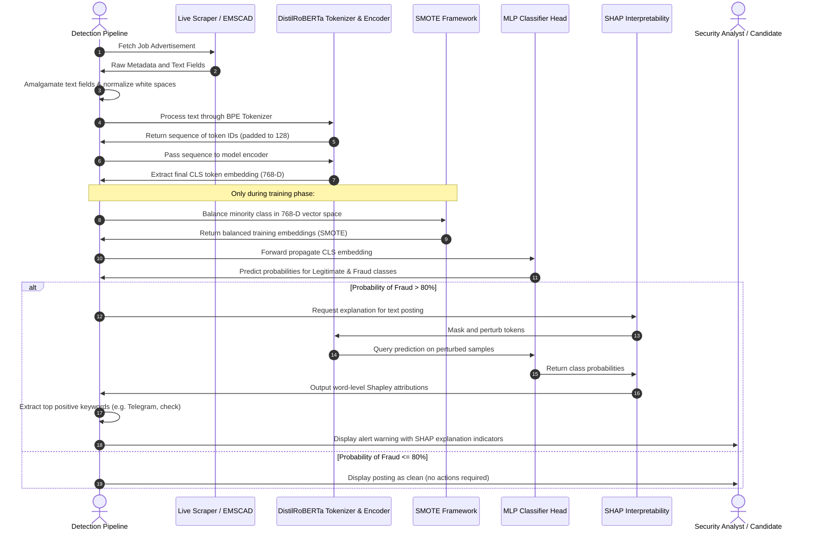

# CHAPTER 3: MATERIALS AND EXPERIMENTAL METHODOLOGY

---

## 3.1. Introduction

Job hunting has shifted almost entirely online, but this convenience has a dark side. Scammers are increasingly using job boards like LinkedIn, Indeed, and glassdoor to post fake job advertisements. These recruitment scams are not just annoying; they are dangerous. They target people who are often in vulnerable financial positions, tricking them into giving away sensitive identity information, depositing fake checks, or transferring money to buy dummy "work equipment." Finding these fake postings manually is a losing battle. Job sites receive millions of new listings daily, and human moderation teams simply cannot review them all. Furthermore, modern scammers are good at making their postings look professional. They copy-paste actual company profiles and use standard corporate jargon, which easily slips past basic word-filter rules.

To solve this, we built an automated detection pipeline that identifies fraudulent job listings and explains *why* a posting looks suspicious. 

```mermaid
graph TD
    A[Scrape or Collect Raw Job Postings] --> B[Concatenate Text Fields: Title, Company Profile, Description, Requirements, Benefits]
    B --> C[Preprocessing: Whitespace Removal, Null Handling, Filtering]
    C --> D[Stratified Train-Test Split: 80% Train, 20% Test]
    D --> E[Feature Extraction: DistilRoBERTa Pre-trained Transformer]
    E --> F[Extract CLS Token Embeddings: 768-Dimensional Vector]
    F --> G[SMOTE Over-Sampling: Balance Minority Fraud Class in Embedding Space]
    G --> H[Train Classification Head: Multi-Layer Perceptron (128, 64)]
    H --> I[Evaluate on Stratified Imbalanced Test Set]
    I --> J[Run Inference & Explainability: SHAP Partition Explainer]
    J --> K[Generate Candidate Security Warning Alerts]
```

As shown in the workflow diagram, our methodology handles the detection process end-to-end. We start with raw job postings from the **EMSCAD** dataset (and live postings scraped from remote job sites). We merge the text fields—such as the job description, company overview, requirements, and benefits—to capture the full context of the posting. Next, we feed this text into **DistilRoBERTa**, a transformer-based language model, to extract a 768-dimensional vector embedding from the start (`[CLS]`) token. 

Because fraudulent postings are rare (making up less than 5% of the total dataset), we run into a major class imbalance issue. If we train our model on this raw distribution, it will just learn to guess "legitimate" every time to get a high accuracy score. To prevent this, we apply **SMOTE** (Synthetic Minority Over-sampling Technique) in the embedding space to generate synthetic fraud samples. We then train a **Multi-Layer Perceptron (MLP)** neural network on the balanced embeddings to classify the job listings. Finally, we use **SHAP** values to break down which words in the posting contributed most to the fraud prediction, allowing us to send clear, explained warnings to job seekers.

---

## 3.2. Data Collection and Preprocessing

### 3.2.1. The EMSCAD Dataset
We evaluated our methodology using the Employment Metadata for Spam Detection (EMSCAD) dataset, which was published by Vidros et al. in 2017. The dataset contains **17,880** real job advertisements. Out of these, only **866** are marked as fraudulent, while **17,014** are legitimate. This is a highly lopsided distribution: scams make up just **4.84%** of the data. This class imbalance matches the real-world job market, where fake listings are relatively rare compared to the massive volume of real hiring ads.

Each record in the dataset is a mix of structured fields (like categorical tags and binary indicators) and free-text fields. The raw features are:
- `title`: The title of the job.
- `location`: Where the job is located.
- `department`: The company division (e.g., Sales, Engineering).
- `salary_range`: Expected salary range (mostly blank).
- `company_profile`: A description of the hiring company.
- `description`: The job details and responsibilities.
- `requirements`: The skills and qualifications needed.
- `benefits`: What the company offers in return (insurance, pay, perks).
- `telecommuting`: A 0/1 flag indicating if the role is remote.
- `has_company_logo`: A 0/1 flag showing if the post has a logo.
- `has_questions`: A 0/1 flag showing if there are screening questions.
- `employment_type`: E.g., Full-time, Part-time, Contract.
- `required_experience`: Entry-level, Associate, Mid-Senior, etc.
- `required_education`: High school, Bachelor's, Master's, etc.
- `industry`: E.g., IT, Marketing, Retail.
- `function`: E.g., Engineering, Customer Service.
- `fraudulent`: The ground-truth label (0 for real, 1 for fake).

| Feature Name | Data Type | Missing Values (%) | Description |
| :--- | :--- | :--- | :--- |
| `title` | Text (Categorical) | 0.00% | The specific job title advertised. |
| `location` | Text (Categorical) | 1.93% | Country, state, and city of the listing. |
| `department` | Text (Categorical) | 64.58% | Department hosting the position. |
| `salary_range` | Text (Numeric range) | 83.95% | Financial compensation bounds. |
| `company_profile` | Free Text | 18.50% | Background description of the hiring entity. |
| `description` | Free Text | 0.01% | Primary job duties and responsibilities. |
| `requirements` | Free Text | 15.07% | Expected skills and educational background. |
| `benefits` | Free Text | 40.32% | Perks, compensations, and bonuses. |
| `telecommuting` | Binary (0 / 1) | 0.00% | Remote working indicator flag. |
| `has_company_logo`| Binary (0 / 1) | 0.00% | Logo presence indicator. |
| `has_questions` | Binary (0 / 1) | 0.00% | Screening questionnaire presence. |
| `employment_type` | Categorical | 19.41% | Type of contract (e.g., Full-time, Contract). |
| `required_experience`| Categorical | 39.43% | Career stage requirements. |
| `required_education`| Categorical | 45.40% | Minimum degree requirements. |
| `industry` | Categorical | 27.42% | Industry classification of the posting. |
| `function` | Categorical | 36.10% | Functional category of the role. |
| `fraudulent` | Binary (0 / 1) | 0.00% | Target label (0: Legitimate, 1: Fraudulent). |

### 3.2.2. Text Field Amalgamation
Many text classification models only analyze the job description column. In recruitment fraud, however, looking at the description alone is often not enough. Scammers frequently copy-paste a genuine job description from a real company but slip their fraudulent terms into other fields. For example, the job duties might look normal, but the `requirements` section might state that candidates "must have a bank account ready to accept check deposits," or the `benefits` section might mention "immediate $1000 sign-on bonus paid via Telegram chat."

To make sure the model looks at the entire picture, we merge the key text fields into a single long string. For each job posting $i$, we create a consolidated text sequence $T_i$:

$$T_i = \text{title}_i \mathbin{\Vert} \text{company\_profile}_i \mathbin{\Vert} \text{description}_i \mathbin{\Vert} \text{requirements}_i \mathbin{\Vert} \text{benefits}_i$$

The double vertical bars ($\mathbin{\Vert}$) represent string concatenation with a space in between. Merging these fields gives the downstream language model the full context of the listing, allowing it to spot discrepancies between the job title, company profile, and requirements.

### 3.2.3. Preprocessing and Text Cleaning
Before feeding the merged text into the language model, we clean it up:
1. **Handling Missing Values:** Text columns in the EMSCAD dataset often contain missing values. When merging the fields, we replace any null or missing values with an empty string (`""`). This prevents the literal word `"nan"` or `"null"` from being written into the middle of the text.
2. **Whitespace Normalization:** Job postings frequently contain formatting artifacts like consecutive spaces, tabs, newlines, and stray HTML tags. We split the string by whitespace and join it back together with single spaces:
   $$T_i \leftarrow \text{" ".join}(T_i\text{.split}())$$
23. **Filtering Empty Records:** If a job post ends up completely empty after this cleaning step, we remove it from the dataset so the model doesn't train on blank inputs.

### 3.2.4. Partitioning and Stratification
We split the cleaned dataset into an **80% training set** and a **20% test set**.

Because the dataset is highly imbalanced (only 4.84% of the posts are fraudulent), a simple random split could easily distort the class ratios. For instance, the test set might receive very few fraudulent postings, making our evaluation metrics unreliable. To prevent this, we use **Stratified Splitting**. This ensures that the training and test sets have the same ratio of legitimate to fraudulent postings (approx. 95.16% to 4.84%) as the full dataset.

If $Y$ is our set of target labels, we divide the data such that:

$$\frac{\sum_{j \in \text{Train}} I(y_j = 1)}{|\text{Train}|} \approx \frac{\sum_{k \in \text{Test}} I(y_k = 1)}{|\text{Test}|} \approx \frac{\sum_{i=1}^N I(y_i = 1)}{N}$$

where $I(\cdot)$ is the indicator function and $N$ is the total count of job listings.

| Dataset Split | Legitimate Class ($y=0$) | Fraudulent Class ($y=1$) | Total Records | Fraudulent Ratio (%) |
| :--- | :---: | :---: | :---: | :---: |
| Full Dataset | 17,014 | 866 | 17,880 | 4.84% |
| **Training Set (80%)** | 13,611 | 693 | 14,304 | 4.84% |
| **Testing Set (20%)** | 3,403 | 173 | 3,576 | 4.84% |

*(Note: During local script execution and testing, we use a stratified sample size of 2,000 records to speed up training, while maintaining these exact target class proportions.)*

---

## 3.3. Model Development: RoBERTa

### 3.3.1. Contextual vs. Static Word Representations
Traditional NLP approaches, like Bag-of-Words (BoW), TF-IDF, or static embeddings (Word2Vec and GloVe), map each word to a fixed vector. In these systems, the word "check" gets the same mathematical representation whether it is used in a real context ("we conduct a background check") or a fraudulent one ("we will mail you a check to buy a laptop").

To handle these differences, modern systems use Transformer models. Transformers generate contextual representations, meaning the vector for a word is dynamically computed based on the words around it. The model uses the self-attention mechanism to focus on relevant context words when calculating the representation of a target token.

### 3.3.2. Transformer Architecture and Self-Attention
At the heart of the Transformer is the scaled dot-product attention mechanism. The model projects the input embeddings into three vectors: Queries ($Q$), Keys ($K$), and Values ($V$) using learnable weight matrices. The attention weights are calculated as:

$$\text{Attention}(Q, K, V) = \text{softmax}\left(\frac{Q K^T}{\sqrt{d_k}}\right) V$$

where $d_k$ is the dimension of the key vectors. Dividing by $\sqrt{d_k}$ prevents the dot products from growing too large in high-dimensional spaces, which would flatten the softmax gradients.

To allow the model to capture different types of relationships between words, we use **Multi-Head Attention**:

$$\text{MultiHead}(Q, K, V) = \text{Concat}(\text{head}_1, \dots, \text{head}_h) \mathbf{W}^O$$

$$\text{where} \quad \text{head}_i = \text{Attention}(Q\mathbf{W}_Q^{(i)}, K\mathbf{W}_K^{(i)}, V\mathbf{W}_V^{(i)})$$

where the $\mathbf{W}$ matrices are projection parameters learned during training.

### 3.3.3. The RoBERTa Model
RoBERTa (Robustly Optimized BERT Approach), developed by Liu et al. in 2019, improves upon the training of the original BERT model. The authors found that BERT was significantly undertrained and introduced several changes:
1. **Dynamic Masking:** BERT masks tokens once during preprocessing. RoBERTa changes the masked tokens dynamically every time a sequence is fed into the model, exposing it to more patterns.
2. **Removing Next Sentence Prediction (NSP):** BERT trains on predicting if sentence B follows sentence A. RoBERTa drops this task, training only on Masked Language Modeling (MLM) with contiguous text sequences, which improves performance on downstream tasks.
3. **Larger Batch Sizes:** Training with larger batch sizes and higher learning rates helps stabilize training.
4. **Larger Vocabulary:** RoBERTa uses a byte-level Byte-Pair Encoding (BPE) vocabulary of 50,265 tokens, which helps it handle out-of-vocabulary words better than BERT's 30,000 character-level tokens.

In our pipeline, we use **DistilRoBERTa (`distilroberta-base`)**. DistilRoBERTa is a distilled version of RoBERTa. It uses 6 transformer layers instead of 12, reducing the parameter count from 125 million to 82 million. DistilRoBERTa retains about **95%** of RoBERTa's language understanding capabilities but runs up to **twice as fast**, making it highly suitable for real-time web scraping and classification tasks.

```
Raw Text: "Urgent: Remote Job..." 
  │
  ▼  [Byte-Pair Encoding Tokenization]
Tokens: [<s>, "Ur", "gent", ":", "ĠRemote", "ĠJob", </s>, <pad>, ...]
  │
  ▼  [6 Transformer Encoder Layers (Self-Attention)]
Contextual Token Embeddings: H ∈ ℝ^(SeqLen x 768)
  │
  ▼  [Extract First Token (CLS Representation)]
CLS Embedding Vector: h_CLS = H[0, :] ∈ ℝ^768
  │
  ▼  [MLP Classifier Head]
  ├─► Dense Layer 1: 768 -> 128 (ReLU Activation)
  ├─► Dense Layer 2: 128 -> 64  (ReLU Activation)
  └─► Output Layer: 64 -> 2     (Softmax Probability Distribution)
```

### 3.3.4. Tokenization and Embedding Extraction
First, we tokenize the merged text sequence $T_i$ using DistilRoBERTa's Byte-Pair Encoder. The tokenizer maps the string into a sequence of token IDs:

$$\mathbf{t} = [t_0, t_1, t_2, \dots, t_{L-1}]$$

where $t_0$ is the start-of-sequence token `<s>` (which corresponds to BERT's `[CLS]`) and $t_{L-1}$ is the end-of-sequence token `</s>`. We pad or truncate the sequences to a maximum length of $L = 128$ tokens.

Next, we pass these tokens through the pre-trained DistilRoBERTa encoder. The output is a matrix of hidden vectors:

$$\mathbf{H}_i = [\mathbf{h}_{i, 0}, \mathbf{h}_{i, 1}, \dots, \mathbf{h}_{i, L-1}], \quad \mathbf{h}_{i, j} \in \mathbb{R}^{768}$$

We extract the vector corresponding to the start token (`<s>`):

$$\mathbf{x}_i = \mathbf{h}_{i, 0} \in \mathbb{R}^{768}$$

Because of the self-attention layers, the start token embedding aggregates context from all other tokens in the sequence, serving as a semantic summary of the entire document. This gives us a dense, 768-dimensional embedding vector $\mathbf{x}_i$ for each job listing.

### 3.3.5. Multi-Layer Perceptron (MLP) Classifier Head
We feed the extracted 768-dimensional embedding vectors into a Multi-Layer Perceptron (MLP) classifier head to predict class probabilities.

The MLP architecture consists of:
- **Input Layer:** 768 units (the CLS embedding).
- **Hidden Layer 1:** 128 neurons, using Rectified Linear Unit (ReLU) activation and early stopping validation.
- **Hidden Layer 2:** 64 neurons, using ReLU activation.
- **Output Layer:** 2 neurons, using Softmax to predict class probabilities.

The forward propagation is defined as:

$$\mathbf{z}^{(1)} = \mathbf{W}^{(1)} \mathbf{x}_i + \mathbf{b}^{(1)}$$

$$\mathbf{a}^{(1)} = \text{ReLU}(\mathbf{z}^{(1)}) = \max(0, \mathbf{z}^{(1)})$$

$$\mathbf{z}^{(2)} = \mathbf{W}^{(2)} \mathbf{a}^{(1)} + \mathbf{b}^{(2)}$$

$$\mathbf{a}^{(2)} = \text{ReLU}(\mathbf{z}^{(2)}) = \max(0, \mathbf{z}^{(2)})$$

$$\hat{\mathbf{y}}_i = \text{Softmax}(\mathbf{W}^{(3)} \mathbf{a}^{(2)} + \mathbf{b}^{(3)})$$

where:
- $\mathbf{W}^{(1)} \in \mathbb{R}^{128 \times 768}$, $\mathbf{b}^{(1)} \in \mathbb{R}^{128}$
- $\mathbf{W}^{(2)} \in \mathbb{R}^{64 \times 128}$, $\mathbf{b}^{(2)} \in \mathbb{R}^{64}$
- $\mathbf{W}^{(3)} \in \mathbb{R}^{2 \times 64}$, $\mathbf{b}^{(3)} \in \mathbb{R}^{2}$

The model is trained using the cross-entropy loss function:

$$\mathcal{L} = -\frac{1}{M} \sum_{i=1}^M \left[ y_i \log(\hat{y}_{i, 1}) + (1 - y_i) \log(\hat{y}_{i, 0}) \right]$$

where $y_i$ is the ground-truth label (0 or 1), and $\hat{y}_{i, 1}$ is the predicted probability of fraud.

To prevent the model from overfitting on the synthetic training samples, we use **10%** of the training data as a validation set. We monitor validation loss during training and trigger **Early Stopping** if the validation loss fails to improve by at least $10^{-4}$ for **10 consecutive epochs**.

---

## 3.4. SMOTE Framework

### 3.4.1. The Imbalance Problem in Fraud Detection
When training machine learning classifiers on highly skewed datasets like EMSCAD (where only 4.84% of samples are fraudulent), standard algorithms often struggle. Because the majority class (legitimate jobs) dominates the loss function, a classifier can achieve 95.16% accuracy by simply predicting that every listing is legitimate. However, this yields a recall of 0%, failing to detect any fraudulent postings.

Common ways to handle this are:
- **Random Under-Sampling (RUS):** Removing majority class samples. This discards valuable training data, which can limit the classifier's ability to model the diversity of legitimate postings.
- **Random Over-Sampling (ROS):** Replicating minority samples. This can lead to overfitting, as the classifier learns to memorize specific fraudulent examples rather than generalizing.

To address these limitations, we implement the **Synthetic Minority Over-sampling Technique (SMOTE)**, proposed by Chawla et al. in 2002.

### 3.4.2. Mathematical Formulation of SMOTE
SMOTE generates new, synthetic examples of the minority class by interpolating between existing minority samples.

For each minority sample $\mathbf{x}_i$ in our training set:
1. Compute the Euclidean distance between $\mathbf{x}_i$ and all other minority samples $\mathbf{x}_j$:
   $$d(\mathbf{x}_i, \mathbf{x}_j) = \sqrt{\sum_{d=1}^D (x_{i, d} - x_{j, d})^2}$$
   where the dimension $D = 768$.
2. Identify the $k$-nearest neighbors. We use the standard setting of $k = 5$.
3. Randomly select one of these $k$-neighbors, denoted as $\mathbf{x}_{nn}$.
4. Generate a synthetic sample $\mathbf{x}_{\text{new}}$ along the line segment connecting the two samples:
   $$\mathbf{x}_{\text{new}} = \mathbf{x}_i + \lambda (\mathbf{x}_{nn} - \mathbf{x}_i)$$
   where $\lambda$ is a random value drawn from a uniform distribution:
   $$\lambda \sim U(0, 1)$$

This process creates new minority samples within the feature space, expanding the decision boundary of the minority class.

```
       768-Dimensional Embedding Space
       
       (Legitimate Class: ◌,  Fraudulent Class: ●)
       
              ◌        ◌
                   ◌
             ●───────★───────● (x_nn)
            (x_i)  λ-interpolated
                     synthetic
                     
          ●                   ●
```

### 3.4.3. Oversampling in Embedding Space vs. Text Space
Oversampling is typically performed on the raw text (e.g., token replacement or back-translation) or on the vector representations. Applying SMOTE directly to raw text presents significant challenges:
- **Syntactic Disruption:** Randomly interpolating or replacing words often produces ungrammatical sentences that lack natural flow.
- **Discrete Structure:** Text is discrete, making linear interpolation difficult. While methods like token substitution or back-translation exist, they can alter the meaning or introduce noise.

Applying SMOTE in the **continuous 768-dimensional embedding space** of RoBERTa addresses these issues:
- **Semantic Continuity:** RoBERTa's embedding space represents semantic meanings as continuous vectors. Points close to each other in this space share similar semantic concepts.
- **Semantic Interpolation:** When SMOTE interpolates between two fraudulent vectors $\mathbf{x}_i$ and $\mathbf{x}_{nn}$, the resulting vector $\mathbf{x}_{\text{new}}$ represents a blend of the semantic properties of the two parent listings (e.g., combining characteristics of a check-cashing scam and a fake chat-app interview).
- **Efficiency:** Oversampling is performed on numerical vectors, avoiding the need to process raw text.

By balancing the classes post-embedding extraction, we provide the MLP classifier with a balanced training set while retaining the contextual representations generated by DistilRoBERTa.

| Class Label | Pre-SMOTE training Count | Post-SMOTE training Count | Status |
| :--- | :---: | :---: | :---: |
| **Legitimate ($y=0$)** | 13,611 | 13,611 | Unchanged |
| **Fraudulent ($y=1$)** | 693 | 13,611 | Synthetically Oversampled |
| **Total** | 14,304 | 27,222 | Balanced |

---

## 3.5. Experimental Evaluation Techniques

### 3.5.1. Evaluation Metrics
Evaluating a fraud detection model using accuracy alone can be misleading due to class imbalance. In this study, we monitor several performance metrics:

- **Accuracy:** The proportion of correct predictions out of all predictions.
  $$\text{Accuracy} = \frac{TP + TN}{TP + TN + FP + FN}$$
- **Precision:** The proportion of predicted fraud cases that are actually fraudulent. Higher precision reduces false positives, helping to ensure legitimate job postings are not incorrectly flagged.
  $$\text{Precision} = \frac{TP}{TP + FP}$$
- **Recall (Sensitivity):** The proportion of actual fraudulent cases that the model detects. Higher recall reduces false negatives, which is important for identifying as many scams as possible.
  $$\text{Recall} = \frac{TP}{TP + FN}$$
- **F1-Score:** The harmonic mean of precision and recall, providing a single metric that balances both.
  $$\text{F1-Score} = 2 \times \frac{\text{Precision} \times \text{Recall}}{\text{Precision} + \text{Recall}}$$

Here, $TP$ represents True Positives, $TN$ True Negatives, $FP$ False Positives, and $FN$ False Negatives.

### 3.5.2. Precision-Recall Area Under Curve (PR-AUC)
In highly imbalanced contexts, the Receiver Operating Characteristic Area Under the Curve (ROC-AUC) can present an overly optimistic view of model performance. This occurs because ROC-AUC plots the True Positive Rate against the False Positive Rate:

$$\text{FPR} = \frac{FP}{FP + TN}$$

Since the number of true negatives ($TN$, legitimate postings) is large, the denominator for FPR is also large, which can keep the FPR low even when the model produces many false positives.

To address this, we evaluate the model using the **Precision-Recall Area Under the Curve (PR-AUC)**. The PR-AUC evaluates precision against recall across different classification thresholds:

$$\text{PR-AUC} = \int_{0}^{1} P(R) \, dR$$

where $P(R)$ represents precision as a function of recall $R$. PR-AUC focuses on the minority class (fraudulent postings), making it a more reliable metric for evaluating model performance under class imbalance.

### 3.5.3. Explainability Framework: SHAP Values
Machine learning models, particularly deep neural networks, are often criticized for being "black boxes." In high-stakes applications like recruitment fraud detection, users and security analysts need to understand *why* a model flagged a posting as fraudulent. To provide this transparency, we integrate **SHAP (Shapley Additive exPlanations)**, proposed by Lundberg and Lee (2017).

SHAP is based on cooperative game theory. In this context, we treat the individual words in a job posting as "players" in a game, where the "payout" is the model's predicted probability of fraud. The Shapley value allocates a contribution score to each word based on its impact on the prediction.

The Shapley value $\phi_i$ for a feature (word) $i$ is calculated as:

$$\phi_i(v) = \sum_{S \subseteq N \setminus \{i\}} \frac{|S|! (|N| - |S| - 1)!}{|N|!} \left[ v(S \cup \{i\}) - v(S) \right]$$

where:
- $N$ is the set of all input features (all words in the job posting).
- $S$ is a subset of features excluding word $i$.
- $v(S)$ is the model's output probability when only the features in $S$ are present.
- $v(S \cup \{i\}) - v(S)$ is the marginal contribution of word $i$ when added to subset $S$.
- The fractional term $\frac{|S|! (|N| - |S| - 1)!}{|N|!}$ scales the marginal contribution by the number of possible permutations of the subset.

### 3.5.4. Text Partition Explainer for Word Attributions
Calculating exact Shapley values requires evaluating $2^{|N|}$ possible coalitions, which is computationally expensive for long text sequences. To make this tractable, we utilize the **SHAP Partition Explainer**. The partition explainer creates a hierarchical clustering tree over the input tokens based on their proximity. It then estimates Shapley values by calculating contributions across these partitions rather than individual tokens, reducing the computational complexity from exponential to polynomial time.

For raw text, the process works as follows:
1. The text is tokenized into subwords using the DistilRoBERTa tokenizer.
2. A background dataset is established by masking tokens using the tokenizer's `<pad>` token.
3. The model evaluates predictions on various masked sequences to measure how the absence of specific words affects the fraud probability.
4. Token attributions are calculated and mapped back to the input words.
5. Tokens containing RoBERTa's space character (`Ġ`) are cleaned, and punctuation or very short tokens (fewer than 3 characters) are filtered out to focus on meaningful words.

Words with the highest positive SHAP values represent the main contributors to the model's fraud prediction. These identified terms (e.g., "Telegram", "WhatsApp", "check", "deposit", "shipping") are extracted and included in candidate security warnings to provide context for the alert.

---

## 3.6. Summary of Methodology

The methodology proposed in this research implements a structured pipeline to address the challenges of Online Recruitment Fraud (ORF) detection: semantic nuances, class imbalance, and model explainability.

| Pipeline Component | Methods and Tools | Key Hyper-Parameters / Specifications |
| :--- | :--- | :--- |
| **Data Collection** | EMSCAD Corpus & Live Scraper | 17,880 listings (866 Fraudulent, 17,014 Legitimate) |
| **Preprocessing** | Concatenation & Normalization | Features: Title, Profile, Description, Requirements, Benefits |
| **Data Split** | Stratified Train-Test Split | 80% Train (14,304), 20% Test (3,576) |
| **Feature Extraction**| DistilRoBERTa (`distilroberta-base`) | 6 Layers, 768-dim embeddings, sequence length = 128 |
| **Class Balancing** | SMOTE in Vector Space | Neighbor count $k=5$, training sample expansion to 27,222 |
| **Classification Head**| Multi-Layer Perceptron (MLP) | Hidden Layers: `(128, 64)`, activation: ReLU, early stopping |
| **Optimizers & Loss** | Adam Optimizer & Cross-Entropy | Tolerances: $10^{-4}$, patience: 10 epochs |
| **Explainability** | SHAP Partition Explainer | Masker: Text, token attributions aggregated for target class 1 |



By combining DistilRoBERTa for feature extraction, SMOTE for addressing class imbalance, and MLP for classification, the system is designed to detect fraudulent job postings. Integrating SHAP explainability provides transparency, helping users and analysts understand the model's predictions.

